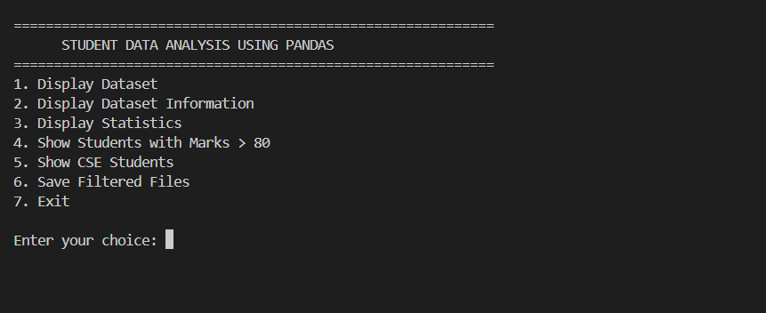
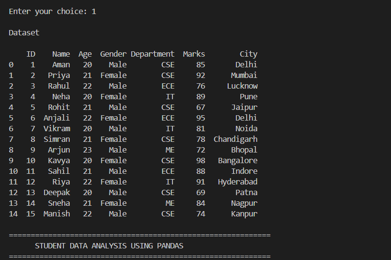
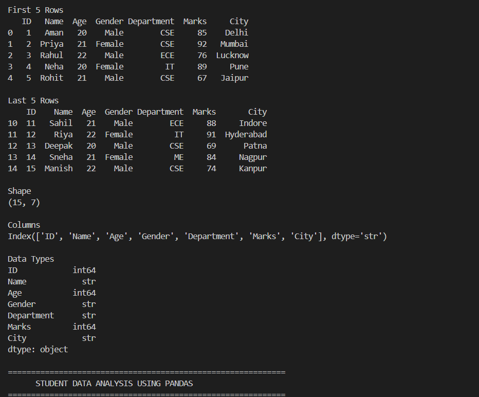
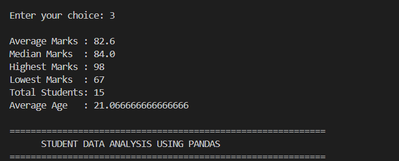
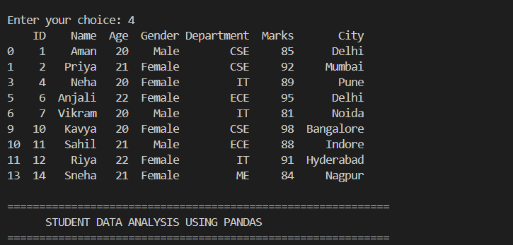

# 📊 Student Data Analysis using Pandas

A beginner-friendly Data Science project developed using **Python**, **Pandas**, and **Matplotlib** to analyze student records stored in a CSV file.

This project demonstrates data loading, exploration, statistical analysis, filtering, exporting datasets, and visualization.

---

# 🚀 Features

- Load CSV dataset using Pandas
- Display the first and last 5 records
- Display dataset shape
- Display column names
- Display data types
- Generate summary statistics
- Calculate:
  - Average Marks
  - Median Marks
  - Highest Marks
  - Lowest Marks
  - Total Students
- Filter students scoring above 80 marks
- Filter students from the CSE department
- Export filtered datasets as CSV files
- Perform advanced data analysis
- Generate student marks visualization using Matplotlib

---

# 🛠 Technologies Used

- Python
- Pandas
- Matplotlib
- CSV

---

# 📂 Project Structure

```
Student-Data-Analysis-Pandas/
│
├── Data/
│   └── students.csv
│
├── output/
│   ├── cse_students.csv
│   ├── department_pie_chart.png
│   ├── high_marks_students.csv
│   └── student_marks_chart.png
│
├── Screenshot/
│   ├── dataset_information.png
│   ├── dataset_outpu.png
│   ├── project_structure.png
│   ├── statistics.png
│   └── Filtered_students/
│       ├── filtered_students.png
│       └── filtered_students_cse.png
│
├── advanced_analysis.py
├── main.py
├── README.md
```

---

# 📋 Dataset Information

The dataset contains the following fields:

| Column | Description |
|---------|-------------|
| ID | Student ID |
| Name | Student Name |
| Age | Student Age |
| Gender | Male / Female |
| Department | Student Department |
| Marks | Student Marks |
| City | Student City |

---

# 📊 Analysis Performed

### Dataset Exploration

- Display complete dataset
- First 5 rows
- Last 5 rows
- Dataset shape
- Column names
- Data types

### Statistical Analysis

- Average Marks
- Median Marks
- Highest Marks
- Lowest Marks
- Total Students

### Data Filtering

- Students with marks greater than 80
- Students from the CSE department

### Advanced Analysis

- Dataset information
- Summary statistics
- Highest scoring student
- Lowest scoring student
- Department-wise student count
- Department-wise average marks
- Gender-wise average marks
- Student marks visualization

---

# 📸 Project Screenshots

## Project Structure



---

## Dataset Output



---

## Dataset Information



---

## Statistics



---

## Filtered Students



---

## 📁 Output Files

The project generates the following output files:

- `high_marks_students.csv`
- `cse_students.csv`
- `department_pie_chart.png`
- `student_marks_chart.png`

These files are automatically saved inside the **output** folder.

---

# 🎯 Learning Outcomes

Through this project, the following concepts were implemented and practiced:

- Python Programming
- Working with CSV Files
- Pandas DataFrames
- Data Exploration
- Data Filtering
- Statistical Analysis
- Data Visualization using Matplotlib
- Git & GitHub Project Management